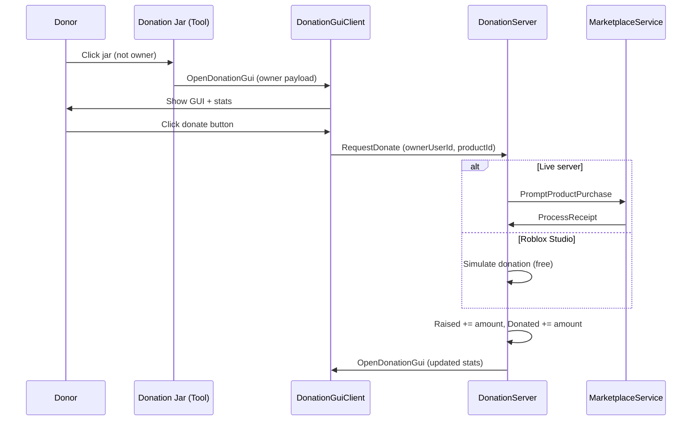

# Donation Jar System (Roblox) — v1

A lightweight **player-to-player donation jar** system for Roblox experiences. Players equip a donation jar tool; other players click it to open a GUI and donate Robux via **Developer Products**. Donations update **leaderstats** (`Raised` for the jar owner, `Donated` for the donor).

> **Version:** v1 — first public release. Core click → GUI → purchase → stats flow is implemented; expand product tiers and polish as needed.

---

## Features

- **Click-to-donate** — `ClickDetector` on jar parts opens the donation UI for nearby players (not the jar owner).
- **Donation GUI** — Shows target display name, username, avatar thumbnail, and current `Raised` / `Donated` values.
- **Developer Products** — Real Robux purchases on live servers through `MarketplaceService` and `ProcessReceipt`.
- **Leaderstats** — Auto-creates `Raised` and `Donated` under each player’s `leaderstats` folder.
- **Studio testing** — Simulated donations in Roblox Studio (no Robux charge) for fast iteration.
- **Server validation** — Blocks self-donations, unknown products, duplicate pending purchases, and (on live servers) donations when players are too far apart.
- **Refresh** — Optional refresh button re-fetches the target’s latest stats from the server.

---

## How it works

1. **Jar tool** (`JarClickServer`) — When a non-owner clicks any `BasePart` on the tool, the server sends owner info to that client.
2. **Client GUI** (`DonationGuiClient`) — Renders the target and fires `RequestDonate` with the chosen Developer Product.
3. **Server** (`DonationServer`) — Validates the request, prompts purchase (or simulates in Studio), then credits stats on successful receipt.

---

## Repository layout

| Path | Role |
|------|------|
| `server/JarClickServer.legacy.luau` | LocalScript inside the **Donation Jar** tool — click detection and `OpenDonationGui` |
| `server/ServerScriptService/DonationServer.legacy.luau` | ServerScript in **ServerScriptService** — purchases, receipts, leaderstats |
| `client/DonationGuiClient.local.luau` | LocalScript under **StarterGui** donation ScreenGui — UI and donate buttons |

Copy each script into the matching Roblox instance (rename `.legacy.luau` / `.local.luau` as needed for your workflow).

---

## Setup (Roblox Studio)

### 1. ReplicatedStorage

Create two **RemoteEvent** instances:

| Name | Direction |
|------|-----------|
| `OpenDonationGui` | Server → Client (also used for refresh: Client → Server) |
| `RequestDonate` | Client → Server |

### 2. ServerScriptService

- Add a **Script** named e.g. `DonationServer`.
- Paste contents from `server/ServerScriptService/DonationServer.legacy.luau`.

### 3. Donation Jar tool

- Create a **Tool** (your jar model) in StarterPack or give via your own system.
- Add a **LocalScript** with `server/JarClickServer.legacy.luau` as a child of the Tool.

### 4. StarterGui

- Create a **ScreenGui** (e.g. `DonationGui`) with your UI layout.
- Suggested hierarchy (flexible names are supported in code):
  - `MainFrame` or `Frame`
    - `TopFrame` — `TargetName`, `TargetUser`, `RaiseLabel` / `RaisedLabel`, `DonatedLabel`, `AvatarImage`, `CloseButton`, optional `RefreshButton`
    - `BottomFrame` — `ScrollingFrame` with **TextButton** / **ImageButton** donate options
- Add **LocalScript** `DonationGuiClient` (from `client/DonationGuiClient.local.luau`) as a child of the ScreenGui.
- Start with `Enabled = false`; the script opens it when a jar is clicked.

### 5. Developer Products

1. In [Creator Dashboard](https://create.roblox.com/) → your experience → **Monetization** → **Developer Products**, create products (e.g. 1 Robux, 5 Robux).
2. Map each **Product ID** to a Robux amount in **both** places:
   - `DonationServer.legacy.luau` → `PRODUCT_AMOUNTS`
   - `DonationGuiClient.local.luau` → `DEFAULT_PRODUCT_IDS_BY_AMOUNT` / `DEFAULT_PRODUCT_IDS_BY_BUTTON_NAME`
3. On each donate button, set attributes (recommended):
   - `ProductId` — Developer Product ID
   - `Amount` — Robux amount (used in Studio simulation)

Example from v1 defaults:

| Robux | Product ID (replace with yours) |
|-------|----------------------------------|
| 1 | `3581351327` |
| 5 | `3581351892` |

### 6. Enable Studio API access (for purchases in Studio)

If you test real prompts in Studio: **Game Settings** → **Security** → enable **Allow Third Party Sales** / API access as required by Roblox for `MarketplaceService` in your setup. v1 uses **simulated** purchases in Studio by default (`RunService:IsStudio()`).

---

## Configuration

| Setting | Location | Default |
|---------|----------|---------|
| Max click distance | `JarClickServer` → `MAX_CLICK_DISTANCE` | `20` studs |
| Max donate distance (live) | `DonationServer` → `isWithinDonationDistance(..., 30)` | `30` studs |
| Studio simulate purchases | `DonationServer` → `STUDIO_SIMULATE_PURCHASES` | `true` in Studio |

---

## v1 limitations & next steps

- Product list is minimal (example: 1 and 5 Robux); extend `PRODUCT_AMOUNTS` and GUI buttons for more tiers.
- Jar owner cannot open their own donation GUI from their jar (by design).
- GUI element names have fallbacks but a consistent layout reduces warnings in Output.
- Replace placeholder Product IDs before publishing to production.

---

## Requirements

- Roblox experience with **Developer Products** configured
- **ProcessReceipt** handled on server (included in `DonationServer`)
- Players in the same server instance (donations are session-based to online targets)

---

## License

Add a license file if you plan to open-source or share this repo publicly.

---

## Author

**Yuan-Hessed-Vasig** — [donation-jar-system-roblox](https://github.com/Yuan-Hessed-Vasig/donation-jar-system-roblox)
